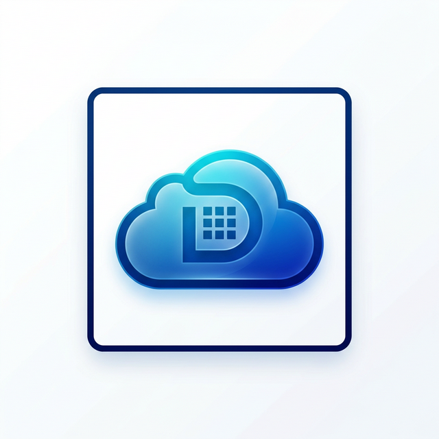

# ☁️ OCI Drive - Secure Object Storage Manager

**OCI Drive** è un'applicazione web moderna e intuitiva progettata per gestire i tuoi file su **Oracle Cloud Infrastructure (OCI) Object Storage** con un'esperienza utente simile a Google Drive. Include funzionalità avanzate di sincronizzazione multi-cloud e trasferimento file rapido.



## 🚀 Funzionalità Principali

### 1. Gestione File Intuitiva
- **Esplora Risorse:** Naviga tra file e cartelle nel tuo bucket OCI.
- **Upload & Download:** Carica file tramite drag-and-drop e scaricali con un click.
- **Anteprima Integrata:** Visualizza PDF, immagini, file di testo e documenti Word (`.docx`) direttamente nel browser.
- **Organizzazione:** Crea, rinomina ed elimina cartelle e file in tempo reale.

### 2. WeTransfer-Style (File Transfer) 🔗
Condividi file in modo sicuro con chiunque tramite link temporanei:
- **Folder Dedicata:** Una sezione "File Transfer" per gestire i file di scambio.
- **Pre-Authenticated Requests (PAR):** Genera link pubblici che non richiedono login.
- **Scadenza Personalizzata:** Imposta la validità del link (1 ora, 24 ore, 7 giorni o 30 giorni).
- **Storico Link:** Visualizza i link attivi e le loro scadenze cliccando sull'icona della catena.

### 3. Google Drive Sync 🔄
Sincronizzazione bidirezionale intelligente:
- **Copia Multi-Cloud:** Importa intere cartelle o singoli file dal tuo Google Drive direttamente su OCI.
- **Sanitizzazione Automatica:** Sistema i nomi dei file per renderli compatibili con gli standard OCI.
- **Logging in Tempo Reale:** Monitora il processo di copia con indicazioni sui file saltati o già esistenti.

### 4. Offline Websites 🌐
Cattura e archivia siti web completi:
- Salva pagine web statiche direttamente nel tuo bucket.
- Ideale per archiviare documentazione o riferimenti importanti da consultare offline.

## 🛠️ Architettura e Logica

L'app è costruita con un approccio **Full-Stack Light**:
- **Backend:** Flask (Python) che comunica con le API di Oracle Cloud tramite l'SDK ufficiale (`oci`).
- **Frontend:** Interfaccia moderna con estetica **Glassmorphism**, costruita in Vanilla JS, HTML5 e CSS3.
- **Storage:** Sfrutta OCI Object Storage per scalabilità illimitata e costi ridotti.
- **Sicurezza:** Autenticazione Google OAuth2 per la sincronizzazione e gestione sicura delle credenziali OCI tramite file di configurazione protetti.

## ⚙️ Requisiti e Installazione

### 1. Prerequisiti
- Python 3.10+
- Un account Oracle Cloud con un Bucket creato.
- Credenziali API Google (per la sincronizzazione).

### 2. Configurazione `.env`
Crea un file `.env` nella root del progetto con i seguenti dati:
```env
OCI_CONFIG_FILE=~/.oci/config
OCI_CONFIG_PROFILE_NAME=DEFAULT
OCI_NAMESPACE=iltuo_namespace
OCI_BUCKET_NAME=oci-drive
OCI_COMPARTMENT_ID=ocid1.compartment.oc1..xxxx

FLASK_SECRET_KEY=una_chiave_segreta_molto_lunga

GOOGLE_CLIENT_ID=tuo_id.apps.googleusercontent.com
GOOGLE_CLIENT_SECRET=tua_segreta
GOOGLE_REDIRECT_URI=http://127.0.0.1:5001/api/gdrive/callback
```

### 3. Avvio
```bash
pip install -r requirements.txt
python app.py
```
L'app sarà disponibile su `http://127.0.0.1:5001`.

## 📁 Struttura del Progetto
- `app.py`: Punto d'ingresso e rotte API.
- `oci_client.py`: Wrapper logico per tutte le operazioni su Oracle Cloud.
- `static/js/main.js`: Logica dell'interfaccia e interazioni asincrone.
- `static/css/style.css`: Design di sistema (Glassmorphism).
- `templates/index.html`: Struttura della Single Page Application.

---
*Progettato per essere veloce, sicuro e scalabile.* 🚀
